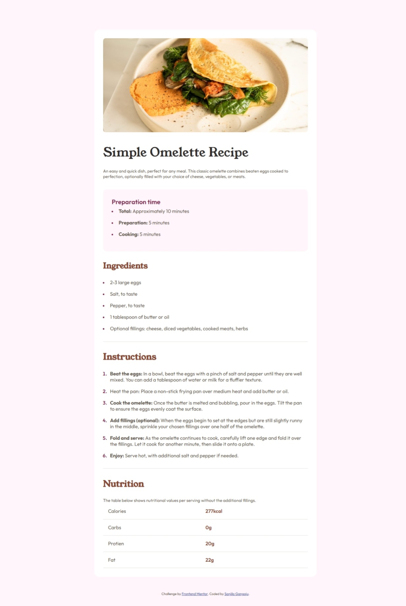
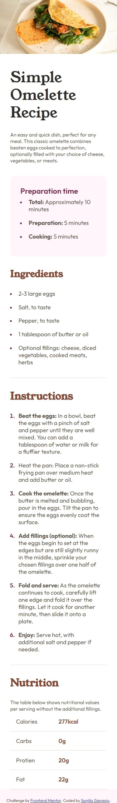

# Frontend Mentor - Recipe page solution

This is a solution to the [Recipe page challenge on Frontend Mentor](https://www.frontendmentor.io/challenges/recipe-page-KiTsR8QQKm). Frontend Mentor challenges help you improve your coding skills by building realistic projects. 

## Table of contents

- [Overview](#overview)
  - [The challenge](#the-challenge)
  - [Screenshot](#screenshot)
  - [Links](#links)
- [My process](#my-process)
  - [Built with](#built-with)
  - [What I learned](#what-i-learned)
  - [Continued development](#continued-development)
  - [Useful resources](#useful-resources)
- [Author](#author)
- [Acknowledgments](#acknowledgments)

## Overview

### Screenshot

# Desktop View

# Mobile  View

### Links

- Solution URL: [https://github.com/SanjilaGangaju/RecipePage]
- Live Site URL: [https://sanjilagangaju.github.io/RecipePage/]

## My process

### Built with

- Semantic HTML5 markup
- CSS custom properties
- Flexbox
- CSS Grid
- Media Queries

### What I learned

Through this project I successfully learned to implement media queries and  also got the opportunity to actually view the real use case of CSS grids. It also help me refresh some topics like styling of list markups.

### Continued development

The proper scaling and alignments were a major problem to me and I should also focus on learning figma and designing parts.

### Useful resources

- (https://developer.mozilla.org/en-US/) - This is an amazing resource. Its always the best idea to refer to these docs when u get stuck.

## Author

- Website - [Add your name here](https://www.your-site.com)- Frontend Mentor - [@yourusername](https://www.frontendmentor.io/profile/SanjilaGangaju)

## Acknowledgments

- (https://www.youtube.com/@kimdoescode) - When I got stuck I refered to this video and he explains it in a nice manner .
